# BackendForge — Multi-Agent Architecture

## 1. System Context (C4 Level 1)

How BackendForge fits into the outside world.

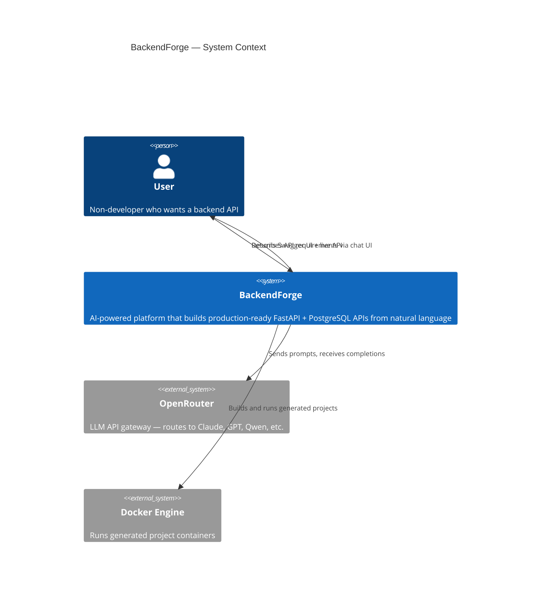
```mermaid
C4Context
    title BackendForge — System Context

    Person(user, "User", "Non-developer who wants a backend API")
    System(bf, "BackendForge", "AI-powered platform that builds production-ready FastAPI + PostgreSQL APIs from natural language")
    System_Ext(openrouter, "OpenRouter", "LLM API gateway — routes to Claude, GPT, Qwen, etc.")
    System_Ext(docker, "Docker Engine", "Runs generated project containers")

    Rel(user, bf, "Describes API requirements via chat UI")
    Rel(bf, openrouter, "Sends prompts, receives completions")
    Rel(bf, docker, "Builds and runs generated projects")
    Rel(bf, user, "Returns Swagger UI + live API")
```

---

## 2. Container Diagram (C4 Level 2)

All major containers and how they communicate.

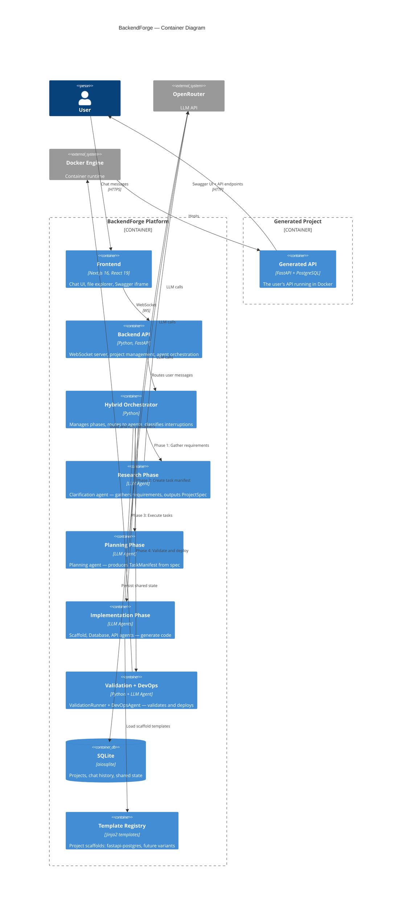
```mermaid
C4Container
    title BackendForge — Container Diagram

    Person(user, "User")

    Container_Boundary(platform, "BackendForge Platform") {
        Container(frontend, "Frontend", "Next.js 16, React 19", "Chat UI, file explorer, Swagger iframe")
        Container(backend, "Backend API", "Python, FastAPI", "WebSocket server, project management, agent orchestration")
        Container(orchestrator, "Hybrid Orchestrator", "Python", "Manages phases, routes to agents, classifies interruptions")
        Container(research, "Research Phase", "LLM Agent", "Clarification agent — gathers requirements, outputs ProjectSpec")
        Container(planning, "Planning Phase", "LLM Agent", "Planning agent — produces TaskManifest from spec")
        Container(implementation, "Implementation Phase", "LLM Agents", "Scaffold, Database, API agents — generate code")
        Container(validation, "Validation + DevOps", "Python + LLM Agent", "ValidationRunner + DevOpsAgent — validates and deploys")
        ContainerDb(sqlite, "SQLite", "aiosqlite", "Projects, chat history, shared state")
        Container(templates, "Template Registry", "Jinja2 templates", "Project scaffolds: fastapi-postgres, future variants")
    }

    Container_Boundary(generated, "Generated Project") {
        Container(genapp, "Generated API", "FastAPI + PostgreSQL", "The user's API running in Docker")
    }

    System_Ext(openrouter, "OpenRouter", "LLM API")
    System_Ext(docker, "Docker Engine", "Container runtime")

    Rel(user, frontend, "Chat messages", "HTTPS")
    Rel(frontend, backend, "WebSocket", "WS")
    Rel(backend, orchestrator, "Routes user messages")
    Rel(orchestrator, research, "Phase 1: Gather requirements")
    Rel(orchestrator, planning, "Phase 2: Create task manifest")
    Rel(orchestrator, implementation, "Phase 3: Execute tasks")
    Rel(orchestrator, validation, "Phase 4: Validate and deploy")
    Rel(research, openrouter, "LLM calls")
    Rel(planning, openrouter, "LLM calls")
    Rel(implementation, openrouter, "LLM calls")
    Rel(validation, docker, "Build and run containers")
    Rel(implementation, templates, "Load scaffold templates")
    Rel(orchestrator, sqlite, "Persist shared state")
    Rel(docker, genapp, "Hosts")
    Rel(genapp, user, "Swagger UI + API endpoints", "HTTP")
```

---

## 3. Full Information Flow

This is the complete journey of information from the moment a user types a message to the moment they see Swagger UI.

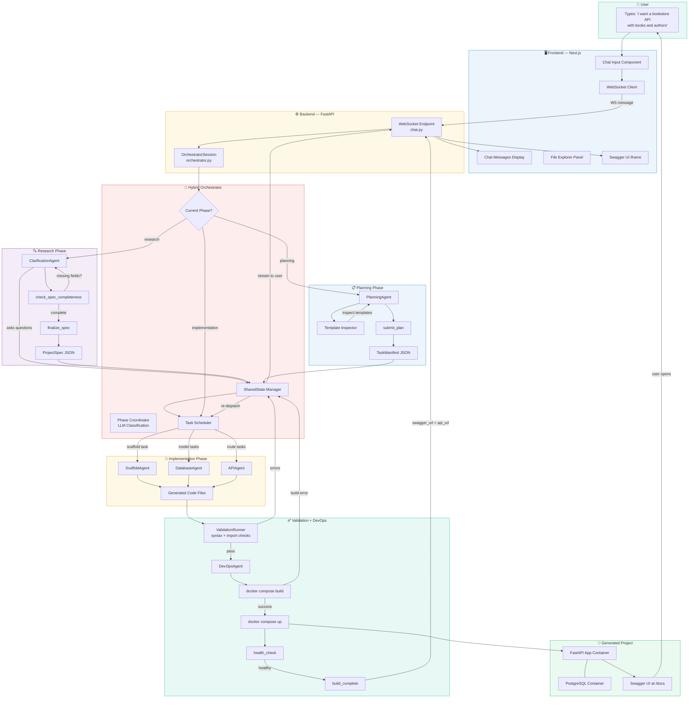
```mermaid
flowchart TD
    subgraph USER["👤 User"]
        U1[Types: 'I want a bookstore API<br>with books and authors']
    end

    subgraph FRONTEND["🖥️ Frontend — Next.js"]
        F1[Chat Input Component]
        F2[WebSocket Client]
        F3[Chat Messages Display]
        F4[File Explorer Panel]
        F5[Swagger UI iframe]
    end

    subgraph BACKEND["⚙️ Backend — FastAPI"]
        B1[WebSocket Endpoint<br>chat.py]
        B2[OrchestratorSession<br>orchestrator.py]
    end

    subgraph ORCHESTRATOR["🎯 Hybrid Orchestrator"]
        O1{Current Phase?}
        O2[Phase Coordinator<br>LLM Classification]
        O3[SharedState Manager]
        O4[Task Scheduler]
    end

    subgraph RESEARCH["🔍 Research Phase"]
        R1[ClarificationAgent]
        R2[check_spec_completeness]
        R3[finalize_spec]
        R4[ProjectSpec JSON]
    end

    subgraph PLANNING["📋 Planning Phase"]
        P1[PlanningAgent]
        P2[Template Inspector]
        P3[submit_plan]
        P4[TaskManifest JSON]
    end

    subgraph IMPLEMENTATION["🔨 Implementation Phase"]
        I1[ScaffoldAgent]
        I2[DatabaseAgent]
        I3[APIAgent]
        I4[Generated Code Files]
    end

    subgraph VALIDATION["✅ Validation + DevOps"]
        V1[ValidationRunner<br>syntax + import checks]
        V2[DevOpsAgent]
        V3[docker compose build]
        V4[docker compose up]
        V5[health_check]
        V6[build_complete]
    end

    subgraph OUTPUT["🚀 Generated Project"]
        G1[FastAPI App Container]
        G2[PostgreSQL Container]
        G3[Swagger UI at /docs]
    end

    U1 --> F1 --> F2 -->|WS message| B1 --> B2 --> O1

    O1 -->|research| R1
    R1 -->|asks questions| O3 -->|stream to user| B1 --> F3
    R1 --> R2 -->|missing fields?| R1
    R2 -->|complete| R3 --> R4 --> O3

    O1 -->|planning| P1
    P1 --> P2 -->|inspect templates| P1
    P1 --> P3 --> P4 --> O3

    O3 --> O4

    O1 -->|implementation| O4
    O4 -->|scaffold task| I1
    O4 -->|model tasks| I2
    O4 -->|route tasks| I3
    I1 --> I4
    I2 --> I4
    I3 --> I4

    I4 --> V1
    V1 -->|errors| O3 -->|re-dispatch| O4
    V1 -->|pass| V2 --> V3
    V3 -->|build error| O3
    V3 -->|success| V4 --> V5
    V5 -->|healthy| V6

    V6 -->|swagger_url + api_url| B1 --> F5
    G1 --- G2
    V4 --> G1
    G1 --> G3
    G3 -->|user opens| U1

    style USER fill:#E8F8F5,stroke:#1ABC9C
    style FRONTEND fill:#EBF5FB,stroke:#2E86C1
    style BACKEND fill:#FEF9E7,stroke:#F39C12
    style ORCHESTRATOR fill:#FDEDEC,stroke:#E74C3C
    style RESEARCH fill:#F4ECF7,stroke:#8E44AD
    style PLANNING fill:#EBF5FB,stroke:#2E86C1
    style IMPLEMENTATION fill:#FEF9E7,stroke:#F39C12
    style VALIDATION fill:#E8F8F5,stroke:#1ABC9C
    style OUTPUT fill:#EAFAF1,stroke:#27AE60
```

---

## 4. Orchestrator Internal Logic

How the hybrid orchestrator makes routing decisions.

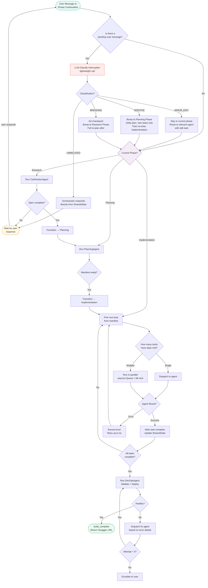
```mermaid
flowchart TD
    START([User Message or<br>Phase Continuation]) --> CHECK{Is there a<br>pending user message?}

    CHECK -->|Yes| CLASSIFY[LLM Classify Interruption<br>lightweight call]
    CHECK -->|No| PHASE

    CLASSIFY --> TYPE{Classification?}
    TYPE -->|MINOR_EDIT| STAY[Stay in current phase<br>Route to relevant agent<br>with edit task]
    TYPE -->|ADDITIVE| BUMP_PLAN[Bump to Planning Phase<br>Delta plan: new tasks only<br>Then re-enter Implementation]
    TYPE -->|BREAKING| BUMP_RESEARCH[Git checkpoint<br>Bump to Research Phase<br>Full re-plan after]
    TYPE -->|UNRELATED| RESPOND[Orchestrator responds<br>directly from SharedState]

    STAY --> PHASE
    BUMP_PLAN --> PHASE
    BUMP_RESEARCH --> PHASE
    RESPOND --> WAIT

    PHASE{Current Phase?}
    PHASE -->|Research| RUN_RESEARCH[Run ClarificationAgent]
    PHASE -->|Planning| RUN_PLANNING[Run PlanningAgent]
    PHASE -->|Implementation| PICK_TASK[Pick next task<br>from manifest]

    RUN_RESEARCH --> SPEC_DONE{Spec complete?}
    SPEC_DONE -->|No| WAIT([Wait for user<br>response])
    SPEC_DONE -->|Yes| TRANSITION_PLAN[Transition → Planning]
    TRANSITION_PLAN --> RUN_PLANNING

    RUN_PLANNING --> MANIFEST_DONE{Manifest ready?}
    MANIFEST_DONE -->|Yes| TRANSITION_IMPL[Transition → Implementation]
    TRANSITION_IMPL --> PICK_TASK

    PICK_TASK --> BATCH{How many tasks<br>have deps met?}
    BATCH -->|Single| DISPATCH[Dispatch to agent]
    BATCH -->|Multiple| PARALLEL[Run in parallel<br>asyncio.Queue + file lock]

    DISPATCH --> RESULT{Agent Result?}
    PARALLEL --> RESULT
    RESULT -->|Success| MARK_DONE[Mark task complete<br>Update SharedState]
    RESULT -->|Error| ERROR_HANDLE[Record error<br>Retry up to 3x]

    MARK_DONE --> ALL_DONE{All tasks<br>complete?}
    ALL_DONE -->|No| PICK_TASK
    ALL_DONE -->|Yes| RUN_DEVOPS[Run DevOpsAgent<br>Validate + Deploy]
    ERROR_HANDLE --> PICK_TASK

    RUN_DEVOPS --> DEPLOY_OK{Healthy?}
    DEPLOY_OK -->|Yes| COMPLETE([build_complete<br>Return Swagger URL])
    DEPLOY_OK -->|No| AUTO_FIX[Dispatch fix agent<br>based on error details]
    AUTO_FIX --> RETRY{Attempt < 3?}
    RETRY -->|Yes| RUN_DEVOPS
    RETRY -->|No| ESCALATE[Escalate to user]

    WAIT -->|user responds| START

    style START fill:#E8F8F5,stroke:#1ABC9C
    style COMPLETE fill:#EAFAF1,stroke:#27AE60
    style WAIT fill:#FEF9E7,stroke:#F39C12
    style CLASSIFY fill:#FDEDEC,stroke:#E74C3C
    style PHASE fill:#F4ECF7,stroke:#8E44AD
```

---

## 5. Research Phase — Internal Detail

How the ClarificationAgent gathers requirements and produces a ProjectSpec.

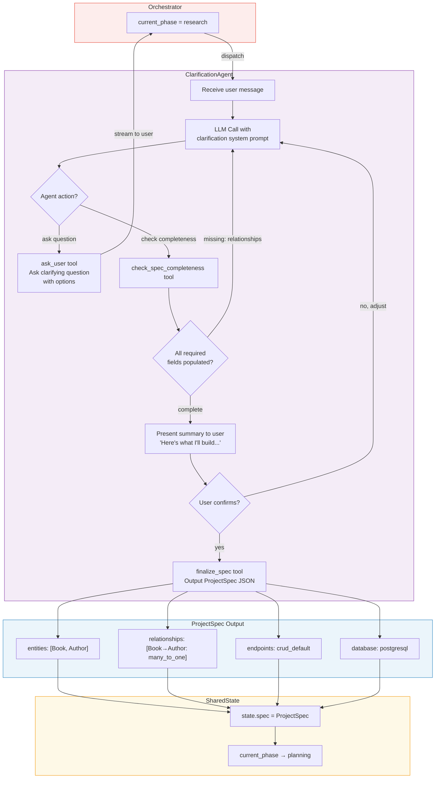
```mermaid
flowchart TD
    subgraph ORCHESTRATOR["Orchestrator"]
        O1[current_phase = research]
    end

    subgraph RESEARCH["ClarificationAgent"]
        R1[Receive user message]
        R2[LLM Call with<br>clarification system prompt]
        R3{Agent action?}
        R4[ask_user tool<br>Ask clarifying question<br>with options]
        R5[check_spec_completeness tool]
        R6{All required<br>fields populated?}
        R7[Present summary to user<br>'Here's what I'll build...']
        R8{User confirms?}
        R9[finalize_spec tool<br>Output ProjectSpec JSON]
    end

    subgraph SPEC["ProjectSpec Output"]
        S1["entities: [Book, Author]"]
        S2["relationships: [Book→Author: many_to_one]"]
        S3["endpoints: crud_default"]
        S4["database: postgresql"]
    end

    subgraph STATE["SharedState"]
        ST1[state.spec = ProjectSpec]
        ST2[current_phase → planning]
    end

    O1 -->|dispatch| R1
    R1 --> R2 --> R3
    R3 -->|ask question| R4 -->|stream to user| O1
    R3 -->|check completeness| R5 --> R6
    R6 -->|missing: relationships| R2
    R6 -->|complete| R7
    R7 --> R8
    R8 -->|no, adjust| R2
    R8 -->|yes| R9

    R9 --> S1 & S2 & S3 & S4
    S1 & S2 & S3 & S4 --> ST1 --> ST2

    style ORCHESTRATOR fill:#FDEDEC,stroke:#E74C3C
    style RESEARCH fill:#F4ECF7,stroke:#8E44AD
    style SPEC fill:#EBF5FB,stroke:#2E86C1
    style STATE fill:#FEF9E7,stroke:#F39C12
```

### Spec Completeness Checklist

The `check_spec_completeness` tool evaluates against this internal checklist:

| Field | Required? | Example |
|-------|-----------|---------|
| At least 1 entity | ✅ Yes | `Book` |
| All entities have fields with types | ✅ Yes | `title: str, price: float` |
| Relationships defined (if >1 entity) | ✅ Yes | `Book → Author: many_to_one` |
| Database confirmed | ✅ Yes | `postgresql` |
| Endpoint style confirmed | ⚪ Optional | `crud_default` |
| Auth requirements | ⚪ Optional | `false` |
| Special requirements | ⚪ Optional | `[]` |

The agent transitions to summary when all **required** fields are populated. Optional fields use defaults if not specified.

---

## 6. Planning Phase — Internal Detail

How the PlanningAgent produces a TaskManifest from the ProjectSpec.

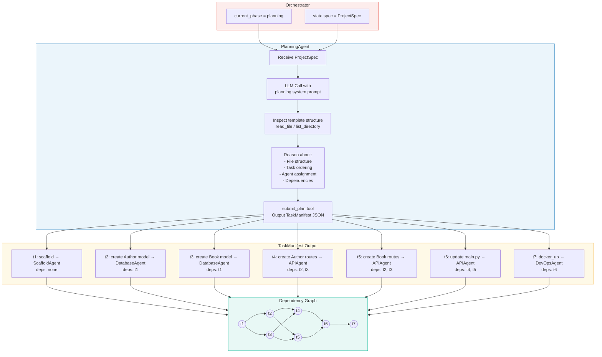
```mermaid
flowchart TD
    subgraph ORCHESTRATOR["Orchestrator"]
        O1[current_phase = planning]
        O2[state.spec = ProjectSpec]
    end

    subgraph PLANNING["PlanningAgent"]
        P1[Receive ProjectSpec]
        P2[LLM Call with<br>planning system prompt]
        P3[Inspect template structure<br>read_file / list_directory]
        P4[Reason about:<br>- File structure<br>- Task ordering<br>- Agent assignment<br>- Dependencies]
        P5[submit_plan tool<br>Output TaskManifest JSON]
    end

    subgraph MANIFEST["TaskManifest Output"]
        T1["t1: scaffold → ScaffoldAgent<br>deps: none"]
        T2["t2: create Author model → DatabaseAgent<br>deps: t1"]
        T3["t3: create Book model → DatabaseAgent<br>deps: t1"]
        T4["t4: create Author routes → APIAgent<br>deps: t2, t3"]
        T5["t5: create Book routes → APIAgent<br>deps: t2, t3"]
        T6["t6: update main.py → APIAgent<br>deps: t4, t5"]
        T7["t7: docker_up → DevOpsAgent<br>deps: t6"]
    end

    subgraph DEPS["Dependency Graph"]
        D1((t1)) --> D2((t2)) & D3((t3))
        D2 & D3 --> D4((t4)) & D5((t5))
        D4 & D5 --> D6((t6))
        D6 --> D7((t7))
    end

    O1 --> P1
    O2 --> P1
    P1 --> P2 --> P3 --> P4 --> P5
    P5 --> T1 & T2 & T3 & T4 & T5 & T6 & T7
    T1 & T2 & T3 & T4 & T5 & T6 & T7 --> DEPS

    style ORCHESTRATOR fill:#FDEDEC,stroke:#E74C3C
    style PLANNING fill:#EBF5FB,stroke:#2E86C1
    style MANIFEST fill:#FEF9E7,stroke:#F39C12
    style DEPS fill:#E8F8F5,stroke:#1ABC9C
```

### Delta Planning (Mid-Build Additive Changes)

When the orchestrator classifies a user interruption as `ADDITIVE`, the planning agent runs in delta mode:

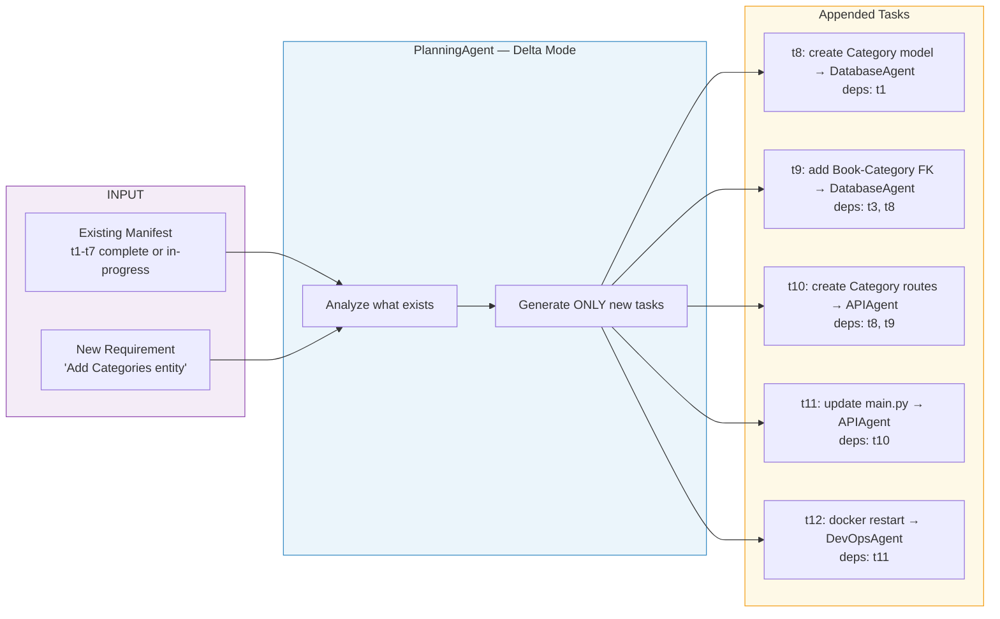
```mermaid
flowchart LR
    subgraph INPUT
        A[Existing Manifest<br>t1-t7 complete or in-progress]
        B[New Requirement<br>'Add Categories entity']
    end

    subgraph DELTA_PLAN["PlanningAgent — Delta Mode"]
        C[Analyze what exists]
        D[Generate ONLY new tasks]
    end

    subgraph OUTPUT["Appended Tasks"]
        E["t8: create Category model → DatabaseAgent<br>deps: t1"]
        F["t9: add Book-Category FK → DatabaseAgent<br>deps: t3, t8"]
        G["t10: create Category routes → APIAgent<br>deps: t8, t9"]
        H["t11: update main.py → APIAgent<br>deps: t10"]
        I["t12: docker restart → DevOpsAgent<br>deps: t11"]
    end

    A --> C
    B --> C
    C --> D --> E & F & G & H & I

    style INPUT fill:#F4ECF7,stroke:#8E44AD
    style DELTA_PLAN fill:#EBF5FB,stroke:#2E86C1
    style OUTPUT fill:#FEF9E7,stroke:#F39C12
```

---

## 7. Implementation Phase — Internal Detail

How the orchestrator dispatches tasks to specialist agents. Tasks with satisfied dependencies are executed **in parallel** using an `asyncio.Queue`-based worker pool with a shared file lock for write serialization.

After the scaffold task completes, the orchestrator builds a **shared context** (directory listing, `database.py`, `main.py`, `models/__init__.py`) that is pre-seeded into subsequent agent messages, eliminating redundant file reads.

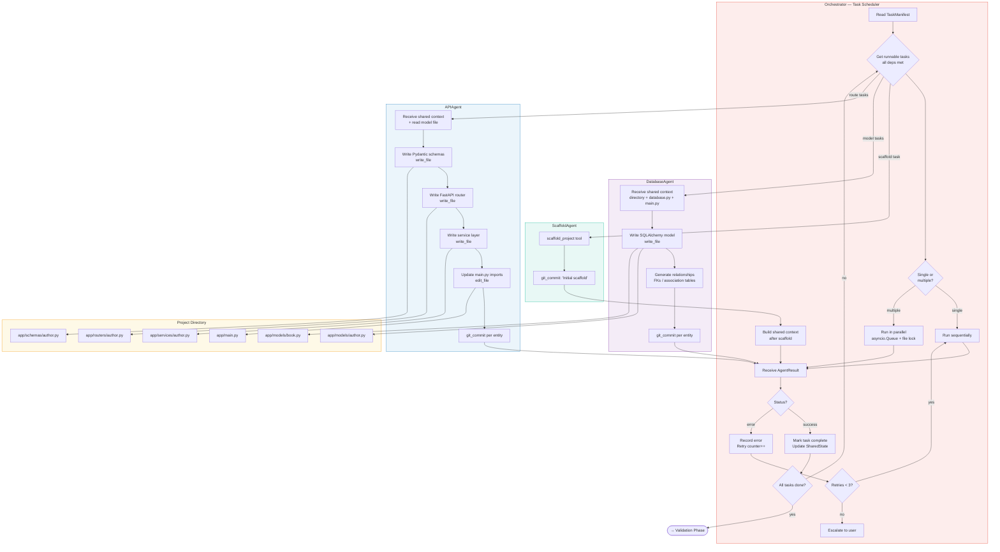
```mermaid
flowchart TD
    subgraph ORCHESTRATOR["Orchestrator — Task Scheduler"]
        O1[Read TaskManifest]
        O2{Get runnable tasks<br>all deps met}
        O2B{Single or<br>multiple?}
        O3A[Run sequentially]
        O3B[Run in parallel<br>asyncio.Queue + file lock]
        O_CTX[Build shared context<br>after scaffold]
        O4[Receive AgentResult]
        O5{Status?}
        O6[Mark task complete<br>Update SharedState]
        O7[Record error<br>Retry counter++]
        O8{Retries < 3?}
        O9[Escalate to user]
        O10{All tasks done?}
    end

    subgraph SCAFFOLD["ScaffoldAgent"]
        S1[scaffold_project tool]
        S2[git_commit: 'Initial scaffold']
    end

    subgraph DATABASE["DatabaseAgent"]
        DB1[Receive shared context<br>directory + database.py + main.py]
        DB2[Write SQLAlchemy model<br>write_file]
        DB3[Generate relationships<br>FKs / association tables]
        DB4[git_commit per entity]
    end

    subgraph API["APIAgent"]
        A1[Receive shared context<br>+ read model file]
        A2[Write Pydantic schemas<br>write_file]
        A3[Write FastAPI router<br>write_file]
        A4[Write service layer<br>write_file]
        A5[Update main.py imports<br>edit_file]
        A6[git_commit per entity]
    end

    subgraph FILES["Project Directory"]
        F1[app/models/author.py]
        F2[app/models/book.py]
        F3[app/schemas/author.py]
        F4[app/routers/author.py]
        F5[app/services/author.py]
        F6[app/main.py]
    end

    O1 --> O2
    O2 --> O2B
    O2B -->|single| O3A --> O4
    O2B -->|multiple| O3B --> O4
    O2 -->|scaffold task| S1 --> S2 --> O_CTX --> O4
    O2 -->|model tasks| DB1 --> DB2 --> DB3 --> DB4 --> O4
    O2 -->|route tasks| A1 --> A2 --> A3 --> A4 --> A5 --> A6 --> O4

    O4 --> O5
    O5 -->|success| O6 --> O10
    O5 -->|error| O7 --> O8
    O8 -->|yes| O3A
    O8 -->|no| O9
    O10 -->|no| O2
    O10 -->|yes| DONE([→ Validation Phase])

    DB2 --> F1 & F2
    A2 --> F3
    A3 --> F4
    A4 --> F5
    A5 --> F6

    style ORCHESTRATOR fill:#FDEDEC,stroke:#E74C3C
    style SCAFFOLD fill:#E8F8F5,stroke:#1ABC9C
    style DATABASE fill:#F4ECF7,stroke:#8E44AD
    style API fill:#EBF5FB,stroke:#2E86C1
    style FILES fill:#FEF9E7,stroke:#F39C12
```

### Parallel Execution Details

- **Batch selection:** `get_runnable_tasks()` returns all pending tasks whose dependencies are satisfied
- **Single task:** Runs directly in the main coroutine (no queue overhead)
- **Multiple tasks:** Each gets a fresh agent instance with a shared `asyncio.Lock` for file-modifying operations (`write_file`, `edit_file`, `git_commit`)
- **Context seeding:** After scaffold, the orchestrator pre-reads key files and passes them as `shared_context` so agents skip redundant `read_file` / `list_directory` calls
- **Timeouts:** Each agent run is bounded by `AGENT_TIMEOUT` (default 300s); the queue has a matching timeout to prevent deadlocks

---

## 8. Validation + DevOps Phase — Internal Detail

How validation catches errors and the DevOps agent deploys. The orchestrator runs a **deploy → auto-fix → retry** loop (up to 3 attempts) that dispatches the appropriate specialist agent to fix errors identified by the DevOps agent.

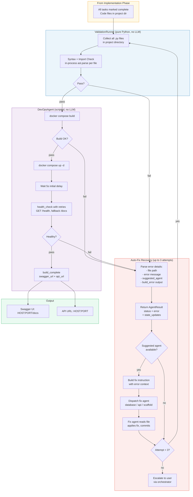
```mermaid
flowchart TD
    subgraph INPUT["From Implementation Phase"]
        I1[All tasks marked complete<br>Code files in project dir]
    end

    subgraph VALIDATION["ValidationRunner (pure Python, no LLM)"]
        V1[Collect all .py files<br>in project directory]
        V2[Syntax + Import Check<br>in-process ast.parse per file]
        V3{Pass?}
    end

    subgraph DEVOPS["DevOpsAgent (scripted, no LLM)"]
        D1[docker compose build]
        D2{Build OK?}
        D3[docker compose up -d]
        D4[Wait 5s initial delay]
        D5[health_check with retries<br>GET /health, fallback /docs]
        D7{Healthy?}
        D8[build_complete<br>swagger_url + api_url]
    end

    subgraph ERROR_LOOP["Auto-Fix Recovery (up to 3 attempts)"]
        E1[Parse error details:<br>- file path<br>- error message<br>- suggested_agent<br>- build_error output]
        E2[Return AgentResult<br>status = error<br>+ state_updates]
        E3{Suggested agent<br>available?}
        E4[Build fix instruction<br>with error context]
        E5[Dispatch fix agent<br>database / api / scaffold]
        E6[Fix agent reads file<br>applies fix, commits]
        E7{Attempt < 3?}
        E8[Escalate to user<br>via orchestrator]
    end

    subgraph SUCCESS["Output"]
        S1["Swagger UI: HOST:PORT/docs"]
        S2["API URL: HOST:PORT"]
    end

    I1 --> V1 --> V2 --> V3
    V3 -->|fail| E1
    V3 -->|pass| D1 --> D2
    D2 -->|fail| E1
    D2 -->|pass| D3 --> D4 --> D5 --> D7
    D7 -->|fail| E1
    D7 -->|pass| D8 --> S1 & S2

    E1 --> E2 --> E3
    E3 -->|yes| E4 --> E5 --> E6 --> E7
    E3 -->|no| E7
    E7 -->|yes| V1
    E7 -->|no| E8

    style INPUT fill:#FEF9E7,stroke:#F39C12
    style VALIDATION fill:#EBF5FB,stroke:#2E86C1
    style DEVOPS fill:#F4ECF7,stroke:#8E44AD
    style ERROR_LOOP fill:#FDEDEC,stroke:#E74C3C
    style SUCCESS fill:#EAFAF1,stroke:#27AE60
```

### DevOps Agent Details

The DevOps agent is **scripted** (not LLM-driven) — it runs a fixed sequence of steps with no LLM calls:

1. **Validate** — In-process `ast.parse()` on all `.py` files + import resolution against `requirements.txt` (replaces the old subprocess-per-file `py_compile`)
2. **Build** — `docker compose build`; on failure, calls `get_build_errors()` to extract meaningful error messages
3. **Start** — `docker compose up -d` with 5s initial wait before health checks
4. **Health check** — Up to 5 retries with 5s intervals; falls back to `/docs` if `/health` doesn't exist
5. **build_complete** — Emits the event with Swagger URL and API URL

On any failure, the agent returns a structured `AgentResult` with `state_updates` containing `suggested_agent`, `suggested_fix`, `error_file_path`, and `build_error` output. The orchestrator uses these to dispatch the correct fix agent.

---

## 9. Mid-Build Correction — Full Flow

What happens when a user sends a message during implementation.

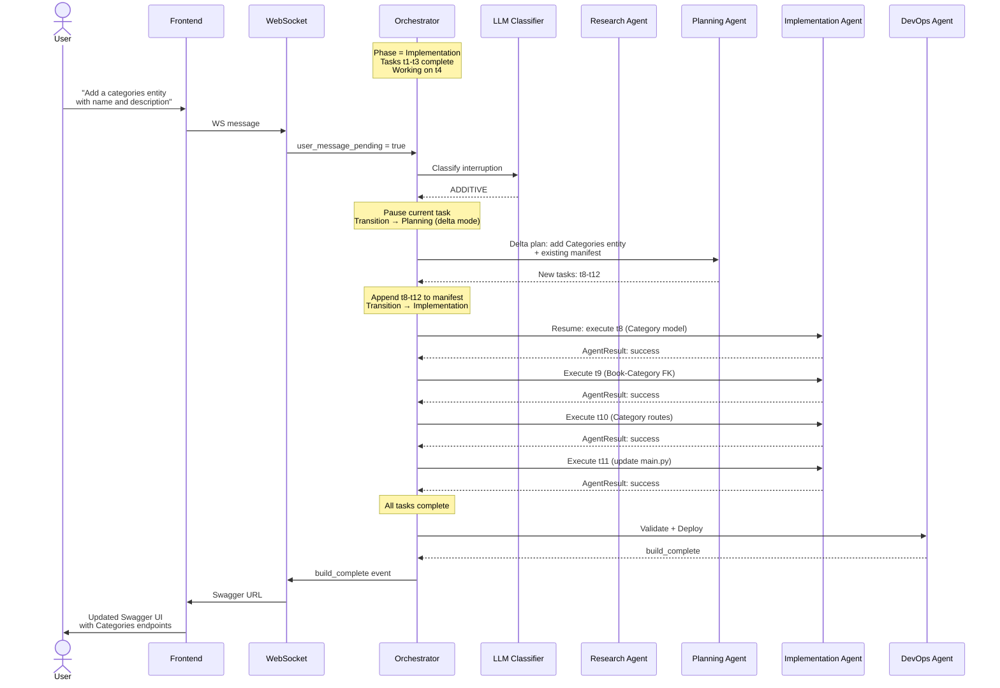
```mermaid
sequenceDiagram
    actor User
    participant FE as Frontend
    participant WS as WebSocket
    participant ORC as Orchestrator
    participant LLM as LLM Classifier
    participant RES as Research Agent
    participant PLN as Planning Agent
    participant IMP as Implementation Agent
    participant DEV as DevOps Agent

    Note over ORC: Phase = Implementation<br>Tasks t1-t3 complete<br>Working on t4

    User->>FE: "Add a categories entity<br>with name and description"
    FE->>WS: WS message
    WS->>ORC: user_message_pending = true

    ORC->>LLM: Classify interruption
    LLM-->>ORC: ADDITIVE

    Note over ORC: Pause current task<br>Transition → Planning (delta mode)

    ORC->>PLN: Delta plan: add Categories entity<br>+ existing manifest
    PLN-->>ORC: New tasks: t8-t12

    Note over ORC: Append t8-t12 to manifest<br>Transition → Implementation

    ORC->>IMP: Resume: execute t8 (Category model)
    IMP-->>ORC: AgentResult: success
    ORC->>IMP: Execute t9 (Book-Category FK)
    IMP-->>ORC: AgentResult: success
    ORC->>IMP: Execute t10 (Category routes)
    IMP-->>ORC: AgentResult: success
    ORC->>IMP: Execute t11 (update main.py)
    IMP-->>ORC: AgentResult: success

    Note over ORC: All tasks complete

    ORC->>DEV: Validate + Deploy
    DEV-->>ORC: build_complete

    ORC->>WS: build_complete event
    WS->>FE: Swagger URL
    FE->>User: Updated Swagger UI<br>with Categories endpoints
```

---

## 10. Data Flow Summary

A simplified view showing what data structure flows between each component.

```mermaid
flowchart LR
    subgraph USER_INPUT["User Input"]
        A["'I want a bookstore API<br>with books and authors'"]
    end

    subgraph RESEARCH["Research Phase"]
        B[ClarificationAgent]
    end

    subgraph SPEC["Data: ProjectSpec"]
        C["entities: [Book, Author]<br>relationships: [many_to_one]<br>database: postgresql"]
    end

    subgraph PLANNING["Planning Phase"]
        D[PlanningAgent]
    end

    subgraph MANIFEST["Data: TaskManifest"]
        E["t1: scaffold<br>t2: Author model<br>t3: Book model<br>t4: Author routes<br>t5: Book routes<br>t6: main.py<br>t7: docker_up"]
    end

    subgraph IMPL["Implementation Phase"]
        F[ScaffoldAgent<br>DatabaseAgent<br>APIAgent]
    end

    subgraph CODE["Data: Code Files"]
        G["models/*.py<br>schemas/*.py<br>routers/*.py<br>services/*.py<br>main.py"]
    end

    subgraph DEVOPS["Validation + DevOps"]
        H[ValidationRunner<br>DevOpsAgent]
    end

    subgraph OUTPUT["Output"]
        I["🚀 Running API<br>Swagger UI at /docs"]
    end

    A -->|natural language| B
    B -->|structured JSON| C
    C --> D
    D -->|ordered task list| E
    E --> F
    F -->|generated files| G
    G --> H
    H -->|docker compose up| I

    style USER_INPUT fill:#E8F8F5,stroke:#1ABC9C
    style RESEARCH fill:#F4ECF7,stroke:#8E44AD
    style SPEC fill:#EBF5FB,stroke:#2E86C1
    style PLANNING fill:#EBF5FB,stroke:#2E86C1
    style MANIFEST fill:#FEF9E7,stroke:#F39C12
    style IMPL fill:#FEF9E7,stroke:#F39C12
    style CODE fill:#FEF9E7,stroke:#F39C12
    style DEVOPS fill:#E8F8F5,stroke:#1ABC9C
    style OUTPUT fill:#EAFAF1,stroke:#27AE60
```

---

## 11. Track Ownership Map

Which team member owns which components (see Section 4 of the Implementation Plan for full details).

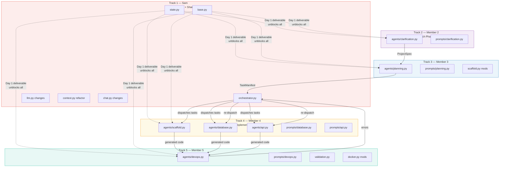
```mermaid
flowchart TD
    subgraph TRACK1["Track 1 — Sam<br>Orchestrator + Shared State"]
        T1A[state.py]
        T1B[base.py]
        T1C[orchestrator.py]
        T1D[llm.py changes]
        T1E[context.py refactor]
        T1F[chat.py changes]
    end

    subgraph TRACK2["Track 2 — Member 2<br>Research Phase Agent"]
        T2A[agents/clarification.py]
        T2B[prompts/clarification.py]
    end

    subgraph TRACK3["Track 3 — Member 3<br>Planning + Templates"]
        T3A[agents/planning.py]
        T3B[prompts/planning.py]
        T3C[scaffold.py mods]
    end

    subgraph TRACK4["Track 4 — Member 4<br>Implementation Agents"]
        T4A[agents/scaffold.py]
        T4B[agents/database.py]
        T4C[agents/api.py]
        T4D[prompts/database.py]
        T4E[prompts/api.py]
    end

    subgraph TRACK5["Track 5 — Member 5<br>Validation + DevOps"]
        T5A[agents/devops.py]
        T5B[prompts/devops.py]
        T5C[validation.py]
        T5D[docker.py mods]
    end

    T1A & T1B -.->|Day 1 deliverable<br>unblocks all| T2A & T3A & T4A & T5A
    T2A -->|ProjectSpec| T3A
    T3A -->|TaskManifest| T1C
    T1C -->|dispatches tasks| T4A & T4B & T4C
    T4A & T4B & T4C -->|generated code| T5A
    T5A -->|errors| T1C -->|re-dispatch| T4B & T4C

    style TRACK1 fill:#FDEDEC,stroke:#E74C3C
    style TRACK2 fill:#F4ECF7,stroke:#8E44AD
    style TRACK3 fill:#EBF5FB,stroke:#2E86C1
    style TRACK4 fill:#FEF9E7,stroke:#F39C12
    style TRACK5 fill:#E8F8F5,stroke:#1ABC9C
```

---

## 12. SharedState Lifecycle

How the SharedState evolves through each phase.

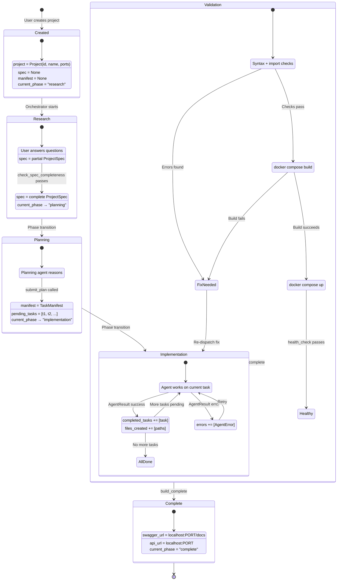
```mermaid
stateDiagram-v2
    [*] --> Created: User creates project

    state Created {
        [*] --> Empty
        Empty: project = Project(id, name, ports)
        Empty: spec = None
        Empty: manifest = None
        Empty: current_phase = "research"
    }

    Created --> Research: Orchestrator starts

    state Research {
        [*] --> Gathering
        Gathering: User answers questions
        Gathering: spec = partial ProjectSpec
        Gathering --> SpecComplete: check_spec_completeness passes
        SpecComplete: spec = complete ProjectSpec
        SpecComplete: current_phase → "planning"
    }

    Research --> Planning: Phase transition

    state Planning {
        [*] --> Analyzing
        Analyzing: Planning agent reasons
        Analyzing --> ManifestReady: submit_plan called
        ManifestReady: manifest = TaskManifest
        ManifestReady: pending_tasks = [t1, t2, ...]
        ManifestReady: current_phase → "implementation"
    }

    Planning --> Implementation: Phase transition

    state Implementation {
        [*] --> Executing
        Executing: Agent works on current task
        Executing --> TaskDone: AgentResult success
        TaskDone: completed_tasks += [task]
        TaskDone: files_created += [paths]
        TaskDone --> Executing: More tasks pending
        TaskDone --> AllDone: No more tasks
        Executing --> Error: AgentResult error
        Error: errors += [AgentError]
        Error --> Executing: Retry
    }

    Implementation --> Validation: All tasks complete

    state Validation {
        [*] --> Checking
        Checking: Syntax + import checks
        Checking --> Building: Checks pass
        Building: docker compose build
        Building --> Deploying: Build succeeds
        Deploying: docker compose up
        Deploying --> Healthy: health_check passes
        Checking --> FixNeeded: Errors found
        Building --> FixNeeded: Build fails
        FixNeeded --> Implementation: Re-dispatch fix
    }

    Validation --> Complete: build_complete

    state Complete {
        [*] --> Running
        Running: swagger_url = localhost:PORT/docs
        Running: api_url = localhost:PORT
        Running: current_phase = "complete"
    }

    Complete --> [*]
```

---

## 13. Resilience and Error Recovery

How the system handles failures at each layer.

### LLM Layer (`llm.py`)

- **Client timeout:** 10s connect, 120s read (configurable via `LLM_TIMEOUT`)
- **Retry with backoff:** Up to 3 attempts with exponential backoff (2s, 4s, 8s) on transient errors (429, 502, 503, 504, connection resets, timeouts)
- **Non-streaming calls** (`chat_completion`) use the same retry logic for classification tasks

### ReAct Loop (`base.py`)

- **Per-turn retry:** Each LLM call within the ReAct loop is retried up to `LLM_MAX_RETRIES` times before giving up
- **Partial stream cleanup:** If a stream fails mid-response, the partial `agent_message_start` is properly closed before retry
- **Tool execution:** File-modifying tools (`write_file`, `edit_file`, `git_commit`) are serialized via `asyncio.Lock` during parallel execution

### Orchestrator (`orchestrator.py`)

- **Agent timeout:** Each `agent.run()` is bounded by `AGENT_TIMEOUT` (default 300s)
- **Parallel task timeout:** `asyncio.Queue.get()` has a matching timeout; hung workers are cancelled and tasks marked for retry
- **Task retry:** Failed tasks are retried up to 3 times before escalating
- **Validation auto-fix:** Deploy failures trigger automatic fix dispatch to the suggested agent (up to 3 deploy → fix → retry cycles)

### Configuration (`config.py`)

| Setting | Default | Purpose |
|---------|---------|---------|
| `LLM_TIMEOUT` | 120s | Per-request HTTP timeout |
| `LLM_MAX_RETRIES` | 3 | Retry count for transient LLM failures |
| `LLM_RETRY_BASE_DELAY` | 2.0s | Exponential backoff base |
| `AGENT_TIMEOUT` | 300s | Max time for a single agent run |