# BackendForge — Multi-Agent Architecture

## 1. System Context (C4 Level 1)

How BackendForge fits into the outside world.

---

## 2. Container Diagram (C4 Level 2)

All major containers and how they communicate.

---

## 3. Full Information Flow

This is the complete journey of information from the moment a user types a message to the moment they see Swagger UI.

---

## 4. Orchestrator Internal Logic

How the hybrid orchestrator makes routing decisions.

```mermaid
flowchart TD
    START([User Message or<br>Phase Continuation]) --> CHECK{Is there a<br>pending user message?}

    CHECK -->|Yes| CLASSIFY[LLM Classify Interruption<br>lightweight call]
    CHECK -->|No| PHASE

    CLASSIFY --> TYPE{Classification?}
    TYPE -->|MINOR_EDIT| STAY[Stay in current phase<br>Route to relevant agent<br>with edit task]
    TYPE -->|ADDITIVE| BUMP_PLAN[Bump to Planning Phase<br>Delta plan: new tasks only<br>Then re-enter Implementation]
    TYPE -->|BREAKING| BUMP_RESEARCH[Git checkpoint<br>Bump to Research Phase<br>Full re-plan after]
    TYPE -->|UNRELATED| RESPOND[Orchestrator responds<br>directly from SharedState]

    STAY --> PHASE
    BUMP_PLAN --> PHASE
    BUMP_RESEARCH --> PHASE
    RESPOND --> WAIT

    PHASE{Current Phase?}
    PHASE -->|Research| RUN_RESEARCH[Run ClarificationAgent]
    PHASE -->|Planning| RUN_PLANNING[Run PlanningAgent]
    PHASE -->|Implementation| PICK_TASK[Pick next task<br>from manifest]

    RUN_RESEARCH --> SPEC_DONE{Spec complete?}
    SPEC_DONE -->|No| WAIT([Wait for user<br>response])
    SPEC_DONE -->|Yes| TRANSITION_PLAN[Transition → Planning]
    TRANSITION_PLAN --> RUN_PLANNING

    RUN_PLANNING --> MANIFEST_DONE{Manifest ready?}
    MANIFEST_DONE -->|Yes| TRANSITION_IMPL[Transition → Implementation]
    TRANSITION_IMPL --> PICK_TASK

    PICK_TASK --> DEPS_MET{Dependencies<br>met?}
    DEPS_MET -->|No| PICK_TASK
    DEPS_MET -->|Yes| DISPATCH[Dispatch to agent:<br>scaffold / database / api]

    DISPATCH --> RESULT{Agent Result?}
    RESULT -->|Success| MARK_DONE[Mark task complete<br>Update SharedState]
    RESULT -->|Error| ERROR_HANDLE[Record error<br>Retry up to 3x]

    MARK_DONE --> ALL_DONE{All tasks<br>complete?}
    ALL_DONE -->|No| PICK_TASK
    ALL_DONE -->|Yes| RUN_DEVOPS[Run DevOpsAgent<br>Validate + Deploy]
    ERROR_HANDLE --> PICK_TASK

    RUN_DEVOPS --> DEPLOY_OK{Healthy?}
    DEPLOY_OK -->|Yes| COMPLETE([build_complete<br>Return Swagger URL])
    DEPLOY_OK -->|No| ERROR_HANDLE

    WAIT -->|user responds| START

    style START fill:#E8F8F5,stroke:#1ABC9C
    style COMPLETE fill:#EAFAF1,stroke:#27AE60
    style WAIT fill:#FEF9E7,stroke:#F39C12
    style CLASSIFY fill:#FDEDEC,stroke:#E74C3C
    style PHASE fill:#F4ECF7,stroke:#8E44AD
```

---

## 5. Research Phase — Internal Detail

How the ClarificationAgent gathers requirements and produces a ProjectSpec.

### Spec Completeness Checklist

The `check_spec_completeness` tool evaluates against this internal checklist:

| Field | Required? | Example |
|-------|-----------|---------|
| At least 1 entity | ✅ Yes | `Book` |
| All entities have fields with types | ✅ Yes | `title: str, price: float` |
| Relationships defined (if >1 entity) | ✅ Yes | `Book → Author: many_to_one` |
| Database confirmed | ✅ Yes | `postgresql` |
| Endpoint style confirmed | ⚪ Optional | `crud_default` |
| Auth requirements | ⚪ Optional | `false` |
| Special requirements | ⚪ Optional | `[]` |

The agent transitions to summary when all **required** fields are populated. Optional fields use defaults if not specified.

---

## 6. Planning Phase — Internal Detail

How the PlanningAgent produces a TaskManifest from the ProjectSpec.

### Delta Planning (Mid-Build Additive Changes)

When the orchestrator classifies a user interruption as `ADDITIVE`, the planning agent runs in delta mode:

---

## 7. Implementation Phase — Internal Detail

How the orchestrator dispatches tasks to specialist agents.

```mermaid
flowchart TD
    subgraph ORCHESTRATOR["Orchestrator — Task Scheduler"]
        O1[Read TaskManifest]
        O2{Pick next task<br>with deps met}
        O3[Dispatch to agent]
        O4[Receive AgentResult]
        O5{Status?}
        O6[Mark task complete<br>Update SharedState]
        O7[Record error<br>Retry counter++]
        O8{Retries < 3?}
        O9[Escalate to user]
        O10{All tasks done?}
    end

    subgraph SCAFFOLD["ScaffoldAgent"]
        S1[scaffold_project tool]
        S2[git_commit: 'Initial scaffold']
    end

    subgraph DATABASE["DatabaseAgent"]
        DB1[Read existing models<br>read_file]
        DB2[Write SQLAlchemy model<br>write_file]
        DB3[Generate relationships<br>FKs / association tables]
        DB4[Run alembic migration<br>run_command]
        DB5[git_commit per entity]
    end

    subgraph API["APIAgent"]
        A1[Read existing models<br>read_file]
        A2[Write Pydantic schemas<br>write_file]
        A3[Write FastAPI router<br>write_file]
        A4[Write service layer<br>write_file]
        A5[Update main.py imports<br>edit_file]
        A6[git_commit per entity]
    end

    subgraph FILES["Project Directory"]
        F1[app/models/author.py]
        F2[app/models/book.py]
        F3[app/schemas/author.py]
        F4[app/routers/author.py]
        F5[app/services/author.py]
        F6[app/main.py]
    end

    O1 --> O2
    O2 -->|scaffold task| S1 --> S2 --> O4
    O2 -->|model task| DB1 --> DB2 --> DB3 --> DB4 --> DB5 --> O4
    O2 -->|route task| A1 --> A2 --> A3 --> A4 --> A5 --> A6 --> O4

    O4 --> O5
    O5 -->|success| O6 --> O10
    O5 -->|error| O7 --> O8
    O8 -->|yes| O3
    O8 -->|no| O9
    O10 -->|no| O2
    O10 -->|yes| DONE([→ Validation Phase])

    DB2 --> F1 & F2
    A2 --> F3
    A3 --> F4
    A4 --> F5
    A5 --> F6

    style ORCHESTRATOR fill:#FDEDEC,stroke:#E74C3C
    style SCAFFOLD fill:#E8F8F5,stroke:#1ABC9C
    style DATABASE fill:#F4ECF7,stroke:#8E44AD
    style API fill:#EBF5FB,stroke:#2E86C1
    style FILES fill:#FEF9E7,stroke:#F39C12
```

---

## 8. Validation + DevOps Phase — Internal Detail

How validation catches errors and the DevOps agent deploys.

```mermaid
flowchart TD
    subgraph INPUT["From Implementation Phase"]
        I1[All tasks marked complete<br>Code files in project dir]
    end

    subgraph VALIDATION["ValidationRunner (pure Python, no LLM)"]
        V1[Collect all .py files<br>in project directory]
        V2[Syntax Check<br>python -m py_compile]
        V3{Pass?}
        V4[Import Check<br>verify imports resolve]
        V5{Pass?}
    end

    subgraph DEVOPS["DevOpsAgent (LLM)"]
        D1[docker compose build]
        D2{Build OK?}
        D3[docker compose up -d]
        D4[docker logs — check startup]
        D5{App started?}
        D6[health_check<br>GET /health]
        D7{Healthy?}
        D8[build_complete<br>swagger_url + api_url]
    end

    subgraph ERROR_LOOP["Error Recovery"]
        E1[Parse error details:<br>- file path<br>- error message<br>- line number]
        E2[Return AgentResult<br>status = error]
        E3[Orchestrator re-dispatches<br>to relevant impl agent]
        E4{Retry count < 3?}
        E5[Escalate to user<br>via orchestrator]
    end

    subgraph SUCCESS["Output"]
        S1["🚀 Swagger UI: localhost:PORT/docs"]
        S2["🔗 API URL: localhost:PORT"]
    end

    I1 --> V1 --> V2 --> V3
    V3 -->|fail| E1
    V3 -->|pass| V4 --> V5
    V5 -->|fail| E1
    V5 -->|pass| D1 --> D2
    D2 -->|fail| E1
    D2 -->|pass| D3 --> D4 --> D5
    D5 -->|fail| E1
    D5 -->|pass| D6 --> D7
    D7 -->|fail| E1
    D7 -->|pass| D8 --> S1 & S2

    E1 --> E2 --> E3 --> E4
    E4 -->|yes| V1
    E4 -->|no| E5

    style INPUT fill:#FEF9E7,stroke:#F39C12
    style VALIDATION fill:#EBF5FB,stroke:#2E86C1
    style DEVOPS fill:#F4ECF7,stroke:#8E44AD
    style ERROR_LOOP fill:#FDEDEC,stroke:#E74C3C
    style SUCCESS fill:#EAFAF1,stroke:#27AE60
```

---

## 9. Mid-Build Correction — Full Flow

What happens when a user sends a message during implementation.

```mermaid
sequenceDiagram
    actor User
    participant FE as Frontend
    participant WS as WebSocket
    participant ORC as Orchestrator
    participant LLM as LLM Classifier
    participant RES as Research Agent
    participant PLN as Planning Agent
    participant IMP as Implementation Agent
    participant DEV as DevOps Agent

    Note over ORC: Phase = Implementation<br>Tasks t1-t3 complete<br>Working on t4

    User->>FE: "Add a categories entity<br>with name and description"
    FE->>WS: WS message
    WS->>ORC: user_message_pending = true

    ORC->>LLM: Classify interruption
    LLM-->>ORC: ADDITIVE

    Note over ORC: Pause current task<br>Transition → Planning (delta mode)

    ORC->>PLN: Delta plan: add Categories entity<br>+ existing manifest
    PLN-->>ORC: New tasks: t8-t12

    Note over ORC: Append t8-t12 to manifest<br>Transition → Implementation

    ORC->>IMP: Resume: execute t8 (Category model)
    IMP-->>ORC: AgentResult: success
    ORC->>IMP: Execute t9 (Book-Category FK)
    IMP-->>ORC: AgentResult: success
    ORC->>IMP: Execute t10 (Category routes)
    IMP-->>ORC: AgentResult: success
    ORC->>IMP: Execute t11 (update main.py)
    IMP-->>ORC: AgentResult: success

    Note over ORC: All tasks complete

    ORC->>DEV: Validate + Deploy
    DEV-->>ORC: build_complete

    ORC->>WS: build_complete event
    WS->>FE: Swagger URL
    FE->>User: Updated Swagger UI<br>with Categories endpoints
```

---

## 10. Data Flow Summary

A simplified view showing what data structure flows between each component.

```mermaid
flowchart LR
    subgraph USER_INPUT["User Input"]
        A["'I want a bookstore API<br>with books and authors'"]
    end

    subgraph RESEARCH["Research Phase"]
        B[ClarificationAgent]
    end

    subgraph SPEC["Data: ProjectSpec"]
        C["entities: [Book, Author]<br>relationships: [many_to_one]<br>database: postgresql"]
    end

    subgraph PLANNING["Planning Phase"]
        D[PlanningAgent]
    end

    subgraph MANIFEST["Data: TaskManifest"]
        E["t1: scaffold<br>t2: Author model<br>t3: Book model<br>t4: Author routes<br>t5: Book routes<br>t6: main.py<br>t7: docker_up"]
    end

    subgraph IMPL["Implementation Phase"]
        F[ScaffoldAgent<br>DatabaseAgent<br>APIAgent]
    end

    subgraph CODE["Data: Code Files"]
        G["models/*.py<br>schemas/*.py<br>routers/*.py<br>services/*.py<br>main.py"]
    end

    subgraph DEVOPS["Validation + DevOps"]
        H[ValidationRunner<br>DevOpsAgent]
    end

    subgraph OUTPUT["Output"]
        I["🚀 Running API<br>Swagger UI at /docs"]
    end

    A -->|natural language| B
    B -->|structured JSON| C
    C --> D
    D -->|ordered task list| E
    E --> F
    F -->|generated files| G
    G --> H
    H -->|docker compose up| I

    style USER_INPUT fill:#E8F8F5,stroke:#1ABC9C
    style RESEARCH fill:#F4ECF7,stroke:#8E44AD
    style SPEC fill:#EBF5FB,stroke:#2E86C1
    style PLANNING fill:#EBF5FB,stroke:#2E86C1
    style MANIFEST fill:#FEF9E7,stroke:#F39C12
    style IMPL fill:#FEF9E7,stroke:#F39C12
    style CODE fill:#FEF9E7,stroke:#F39C12
    style DEVOPS fill:#E8F8F5,stroke:#1ABC9C
    style OUTPUT fill:#EAFAF1,stroke:#27AE60
```

---

## 11. Track Ownership Map

Which team member owns which components (see Section 4 of the Implementation Plan for full details).

---

## 12. SharedState Lifecycle

How the SharedState evolves through each phase.

